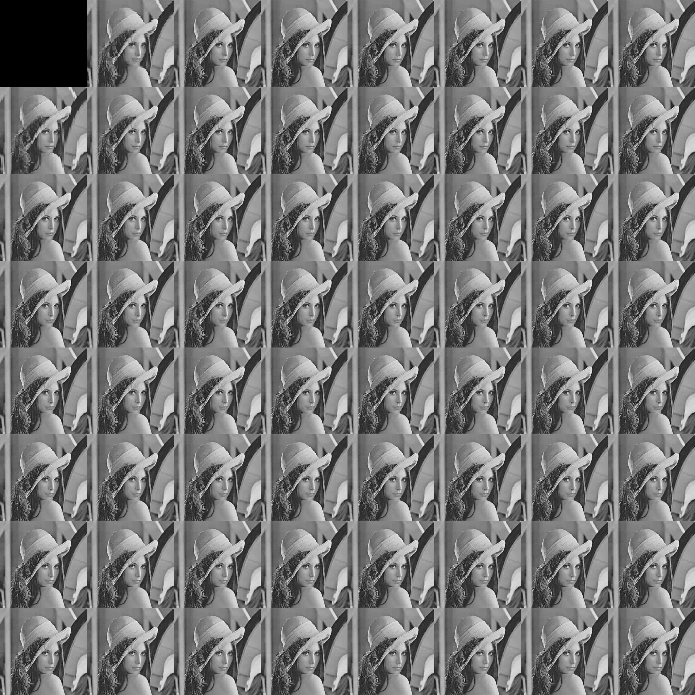
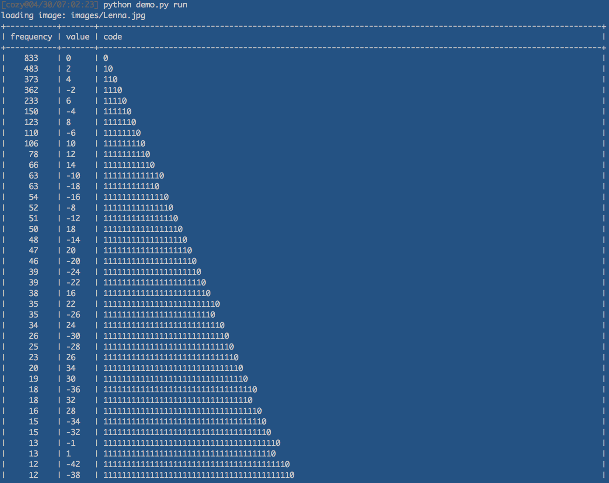
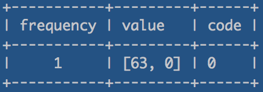
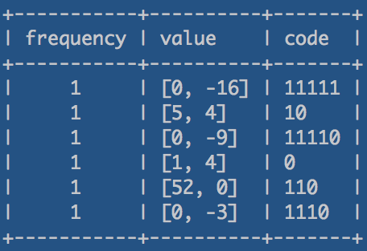

# imarray

imarrayはnumpy.ndarrayを用いたオレオレデータ構造でnumpyの行列演算, 幾つかのPIL API, 画像の表示やファイルの入出力等を行ないます. 
このimarrayを用いて, DCT変換とそれを用いたJPEG圧縮のデモを実装しました. 

***

* 前のバージョンとの違い
* 構成
* デモプログラム
* デモの実行まで
* 参考


## 前のバージョンとの違い

* 前回のバージョン: 画像の周波数係数のうち, 指定したレベルの高周波数を消去することで, 画像の圧縮を実装.

図1: 前回のバージョンでのデモ

* 今回のバージョン: 量子化による高周波の切り捨て, DC/AC成分それぞれのゼロレングス/ハフマン符号化を実装.

図2: オリジナルの画像

図3: 量子化された周波数領域

図3: 量子化された周波数領域と画像を重ね合わせたイメージ

## 構成

デモはimarray.py, zero_length_encoder.py, huffman_encoder.py, jpeg.pyの４つのモジュールからなります.

* imarray.imarray  : numpy.ndarrayをbaseとして画像処理を行いやすいようにデータ構造を実装.
                     numpyの行列演算, 幾つかのPIL API, ファイルの入出力機能等を持つ.

* zero_length_encoder.ZeroLengthEncoder
                   : ゼロレングス符号化を実装.

* huffman_encoder.HuffmanEncoder
                   : ハフマン符号化を実装.

* jpeg.DCT         : 二次元の離散cosine変換を行う, 
                     Frequency Domainを出力するtoFreq, Space Domainを出力するtoSpace関数を持つ.

* jpeg.JPEG        : 上記のimarray, DCT, ZeroLengthEncoder, HuffmanEncoder を用いて実装.

* jpeg.JPEG.encode : imarray.splitでMCUへ分割, DCT.toFreqで周波数領域へ変換, 量子化を行い, 
                     ZIGZAG ORDERにより読み込んだDC/AC成分毎にゼロレングス符号化やハフマン符号化を行う.

* jpeg.JPEG.decode : JPEG.encodeと逆の処理を実装.


## デモプログラム

demo.pyにデモのプログラムを実装しています.
demo.pyでは, 指定した画像を読み込み, 以下の手順でエンコード/デコードを行います.

1. 画像を8x8の最小単位(MCU)に区切り, それぞれをDCTにより周波数領域へ変換する.
2. 各MCUの周波数係数と明度量子化テーブルの積を計算する.
3. 量子化したMCUをジグザグスキャンによりベクトル化を行う.
4. 3で読み込んだベクトルのうちAC成分を0の出現回数についてランレングス符号化し, 更にハフマン符号化を行う.
5. 全てのMCUへ1~4の処理を行う毎に, DC成分を差分として記録し続ける.
6. DC成分の差分を読み込み終えたら, ハフマン符号化を行う.
7. 1~6を逆順に行いデコードを行う.


図4: 上:オリジナル(グレースケール), 下:実装したJPEGのデコード結果.


図5: 各MCUのDC成分を差分として記録し, それらをハフマン符号化したときのハフマンテーブル.


図6: 各MCUのAC成分の符号化例1


図7: 各MCUのAC成分の符号化例2
ゼロレングス符号化, ハフマン符号化の両方を適用し, コンパクトに符号化出来るようハフマンテーブルが作成できている.

## デモの実行まで

### セットアップ

```
pip install -r myjpeg/requirements.txt
```

### 実行

```
python demo.py run images/Lenna.jpg
```

### 実行確認環境

* MacOS  10.12.3
* Python 2.7.10

## 参考

1. [好きなコトして何が悪い！](http://tony-mooori.blogspot.jp/2016/02/dctpythonpython.html)
2. [Wikipedia:JPEG](https://ja.wikipedia.org/wiki/JPEG)
3. [Wikipedia:離散コサイン変換](https://ja.wikipedia.org/wiki/%E9%9B%A2%E6%95%A3%E3%82%B3%E3%82%B5%E3%82%A4%E3%83%B3%E5%A4%89%E6%8F%9B)
4. [Two Dimensional Discrete Cosine Transform (DCT-II) in Python](http://www.answermysearches.com/two-dimensional-discrete-cosine-transform-dct-ii-in-python/350/)
5. [Information Technology - Digital Compression and Coding of Continuous-tone Still Images - Requirements and Guidelines](https://www.w3.org/Graphics/JPEG/itu-t81.pdf)
6. [JPEG DHTの解析](http://www.kamakuraheart.org/wordpress/?p=455)
